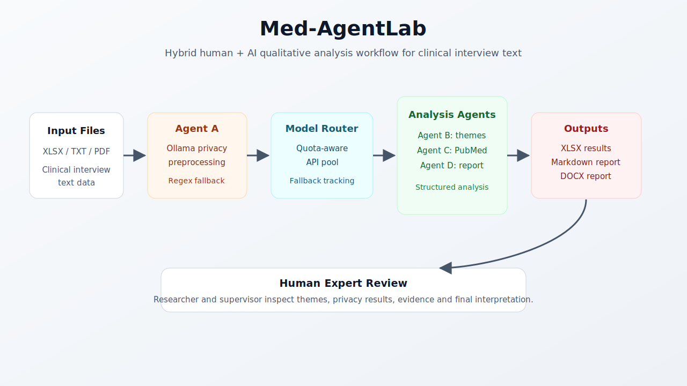

# Med-AgentLab

Med-AgentLab, klinik gorusme metinleri uzerinde gizlilik on-isleme, nitel tema cikarimi, PubMed destekli dogrulama ve akademik rapor uretimi yapan FastAPI tabanli bir bitirme projesi prototipidir. Sistem; Excel, TXT ve PDF girdilerini metne donusturur, yerel Ollama katmani ve regex tabanli koruma ile belirgin kisisel veri oruntulerini maskelemeye calisir, kota-duyarli model havuzu ile analiz yapar ve sonuclari XLSX, Markdown ve DOCX olarak sunar.

> Bu proje klinik karar destek sistemi degildir. Ciktilar akademik/prototip amaclidir ve gercek akademik ya da klinik kullanimdan once insan uzman tarafindan degerlendirilmelidir.

## Graphical Abstract



## Demo Video

[Med-AgentLab demo videosunu YouTube'da izleyin](https://youtu.be/PSuhFNQOkRY).

[](https://youtu.be/PSuhFNQOkRY)

## One-Minute Overview

- **Girdi:** `.xlsx`, `.xls`, `.txt`, `.pdf`
- **Backend:** `app.py` icinde FastAPI API, arka plan isleri, SQLite is gecmisi ve analiz pipeline'i
- **Frontend:** `frontend/index.html` tek sayfalik web arayuzu
- **Yerel gizlilik katmani:** Ollama modeli ve regex tabanli Pattern Guard
- **Model router:** Tema cikarimi, validasyon ve rapor sentezi icin sirali API/model havuzlari
- **Validasyon:** PubMed ESearch/ESummary ile literatur basligi toplama ve LLM destekli kontrol
- **Cikti:** XLSX analiz tablosu, Markdown rapor, DOCX akademik rapor

## Why This Repository Exists

Med-AgentLab, nitel klinik veri analizinde iki pratik soruna odaklanir:

1. Buyuk dil modeli kullaniminda kota, maliyet ve servis kesintisi sorunlari.
2. Klinik metinlerde insan denetimi ve gizlilik ihtiyacini tamamen dislamadan otomasyon kurma ihtiyaci.

Bu nedenle proje yalnizca "bir LLM'e dosya gonderip cevap alma" yaklasimi degildir. Uygulama; yerel on-isleme, API havuzu, ajan gorev ayrimi, PubMed destekli kontrol, indirilebilir raporlar ve insan-in-the-loop degerlendirme fikri etrafinda tasarlanmistir.

## Features

- FastAPI tabanli backend.
- Tek sayfalik HTML/CSS/JavaScript arayuz.
- Dosya yukleme, analiz baslatma, iptal etme, durum izleme ve gecmis isleri listeleme.
- SQLite destekli is kaliciligi.
- Excel satirlarini veya uzun TXT/PDF metinlerini parcalayarak isleme.
- Ollama privacy/preprocessing ajani ve regex fallback.
- Kota-duyarli model havuzu: Groq/Gemini gibi saglayicilar arasinda sirali deneme ve fallback.
- PubMed destekli tema validasyonu.
- Router ve gizlilik metriklerini arayuzde gosterme.
- XLSX, Markdown ve DOCX rapor indirme.
- API havuzu kullanilamadiginda demo-safe yerel fallback mekanizmalari.

## Architecture

```text
User Browser
  |
  |  http://127.0.0.1:8000
  v
frontend/index.html
  |
  |  REST calls
  v
app.py / FastAPI
  |
  +-- Upload parser: XLSX, XLS, TXT, PDF
  +-- SQLite job store: med_agentlab.db
  +-- Agent A: Ollama + regex privacy scrubber
  +-- Agent B: thematic mapper through model pool
  +-- Agent C: PubMed validator through model pool
  +-- Agent D: academic reducer/report synthesizer
  |
  v
outputs/: XLSX, MD, DOCX
```

## Repository Structure

The GitHub landing document is this `README.md`. Project documentation is consolidated under `docs/`; runtime artifacts are ignored.

```text
.
|-- README.md
|-- app.py
|-- frontend/index.html
|-- create_demo_data.py
|-- requirements.txt
|-- .env.example
`-- docs/
    |-- READMEforDOCS.md
    |-- TODO.md
    |-- CHANGELOG.md
    |-- agents.md
    |-- commercial.md
    |-- SWOT.md
    |-- installation.md
    |-- walkthrough.md
    |-- idea.md
    |-- project-text.md
    |-- assets/
    |-- knowledge-base/
    |-- poster/
    |-- reports/
    `-- slides/
```

Runtime folders such as `uploads/`, `outputs/`, local database files, logs, `.env`, and patient-like spreadsheet files are intentionally excluded from Git.

## Installation

Detailed instructions are available in [docs/installation.md](docs/installation.md).

Quick setup:

```bash
python -m venv .venv
.venv\Scripts\activate
pip install -r requirements.txt
copy .env.example .env
```

Install Ollama separately and pull the configured local model if needed:

```bash
ollama pull qwen3:4b
```

Start the application:

```bash
uvicorn app:app --reload --host 127.0.0.1 --port 8000
```

Open:

```text
http://127.0.0.1:8000
```

## Environment Variables

The application reads `.env` through `python-dotenv`.

| Variable | Purpose |
| --- | --- |
| `GROQ_API_KEY` | Groq provider key for model pool calls |
| `GEMINI_API_KEY` | Gemini provider key for model pool calls |
| `OLLAMA_API_BASE` | Local Ollama API base URL |
| `OLLAMA_MODEL` | Local Ollama model used by Agent A |
| `GROQ_MODEL` | Default Groq model |
| `GEMINI_FAST_MODEL` | Default Gemini fast model |
| `GEMINI_LITE_MODEL` | Default Gemini lite model |
| `THEME_MODEL_POOL` | Optional comma-separated model pool for Agent B |
| `VALIDATION_MODEL_POOL` | Optional comma-separated model pool for Agent C |
| `REDUCTION_MODEL_POOL` | Optional comma-separated model pool for Agent D |
| `AGENT_C_MODEL` | Optional validation model override |
| `AGENT_D_MODEL` | Optional report synthesis model override |

## API Summary

| Endpoint | Method | Description |
| --- | --- | --- |
| `/` | GET | Serves the frontend |
| `/upload` | POST | Uploads a file and starts background analysis |
| `/jobs` | GET | Lists known jobs |
| `/status/{job_id}` | GET | Returns progress, logs, router events and privacy metrics |
| `/results/{job_id}` | GET | Returns structured analysis results |
| `/download/{job_id}` | GET | Downloads XLSX output |
| `/download/report/{job_id}` | GET | Downloads Markdown report |
| `/download/report/docx/{job_id}` | GET | Downloads DOCX report |
| `/cancel/{job_id}` | POST | Cancels a running job |
| `/health` | GET | Returns service health |

## Demo Walkthrough

A step-by-step demo script is available in [docs/walkthrough.md](docs/walkthrough.md). The short version:

1. Start Ollama or let the backend attempt to start it before analysis.
2. Run `uvicorn app:app --reload --host 127.0.0.1 --port 8000`.
3. Open `http://127.0.0.1:8000`.
4. Upload a TXT, PDF or Excel file.
5. Watch the progress, terminal logs, router events and privacy metrics.
6. Download XLSX, Markdown or DOCX outputs after completion.

## Documentation Map

- [docs/TODO.md](docs/TODO.md): current tasks and future work.
- [docs/READMEforDOCS.md](docs/READMEforDOCS.md): documentation folder index.
- [docs/agents.md](docs/agents.md): human + AI agent guide.
- [docs/CHANGELOG.md](docs/CHANGELOG.md): project history.
- [docs/commercial.md](docs/commercial.md): commercialization direction.
- [docs/SWOT.md](docs/SWOT.md): competitor-aware SWOT analysis.
- [docs/installation.md](docs/installation.md): setup guide.
- [docs/walkthrough.md](docs/walkthrough.md): usage and demo flow.
- [docs/idea.md](docs/idea.md): current project idea summary.
- [docs/project-text.md](docs/project-text.md): short project text.
- [docs/knowledge-base/final-knowledge-base.md](docs/knowledge-base/final-knowledge-base.md): canonical knowledge base for future LLM work.
- [docs/knowledge-base/pitchdeck_compressed.pdf](docs/knowledge-base/pitchdeck_compressed.pdf): early pitch deck.
- [docs/poster/Med-AgentLab_Poster_A4.pdf](docs/poster/Med-AgentLab_Poster_A4.pdf): project poster.
- [docs/reports/EminALTAN221118024-FinalRapor.pdf](docs/reports/EminALTAN221118024-FinalRapor.pdf): final report PDF.
- [docs/slides/Med-AgentLab_Final_Sunum2.pptx](docs/slides/Med-AgentLab_Final_Sunum2.pptx): final presentation.

## Development Notes

- Active backend entry point is `app.py`.
- `main.py` was an older reference implementation and has been removed from the active repository.
- The frontend is not a separate Node/React project; it is a static HTML interface served by FastAPI.
- The project uses Python libraries because the pipeline, API integration, document generation and data processing stack are implemented in Python.
- `.env`, runtime outputs, local databases and logs should never be committed.

## Academic and Clinical Disclaimer

Med-AgentLab is a graduation project prototype. It can help structure qualitative analysis workflows, but it does not replace a clinician, researcher, ethics board, supervisor or domain expert.
